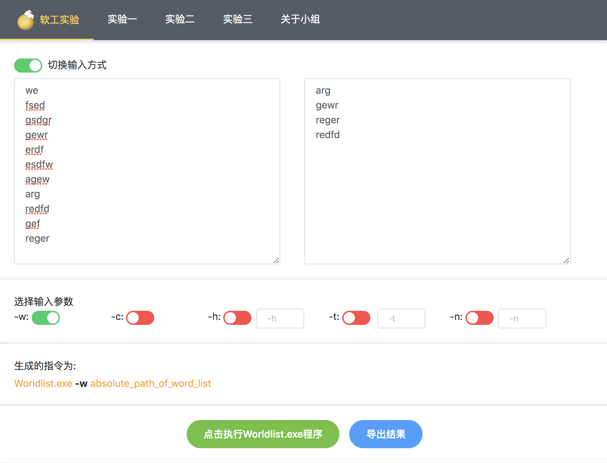
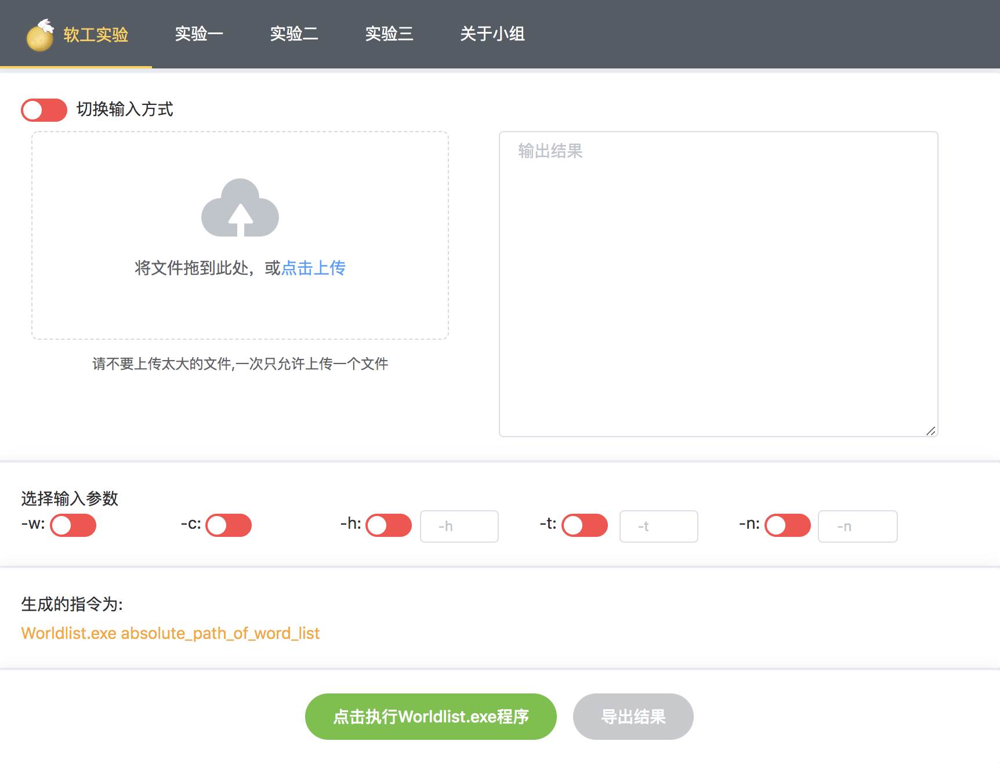
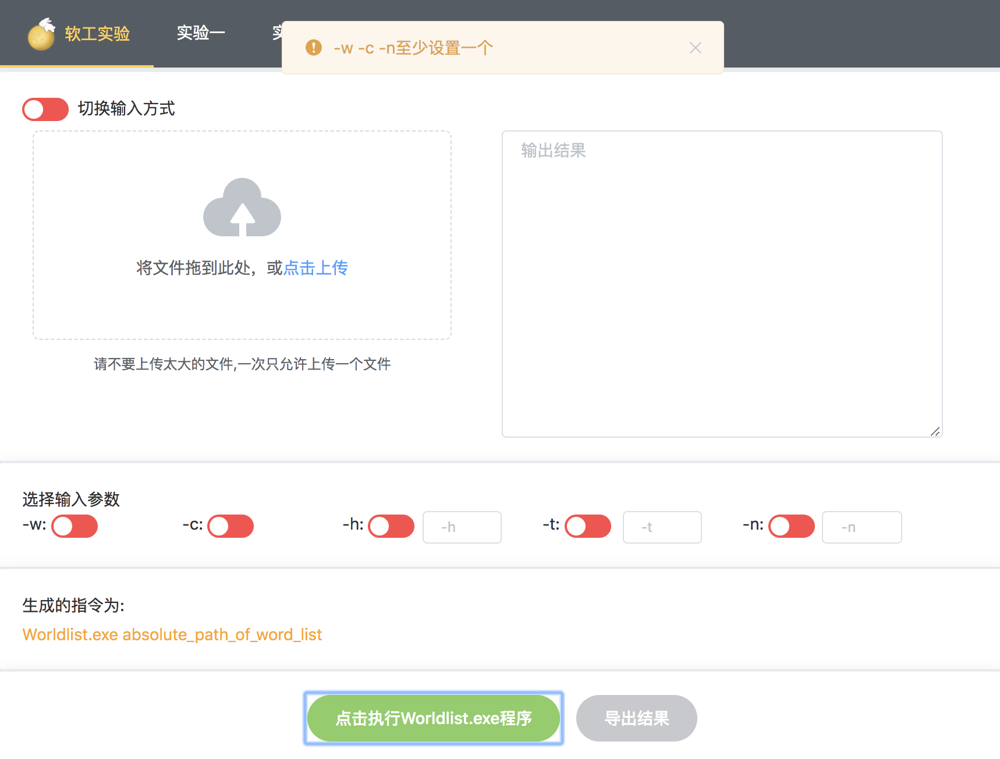
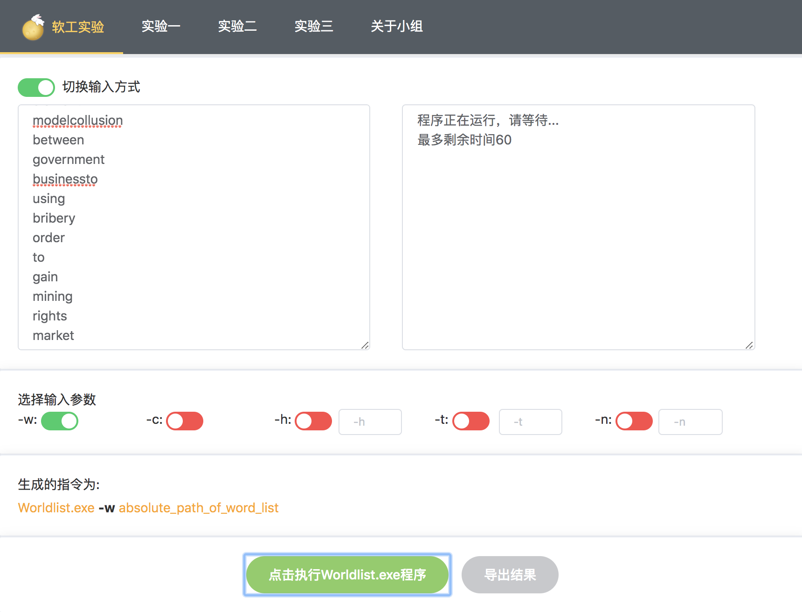
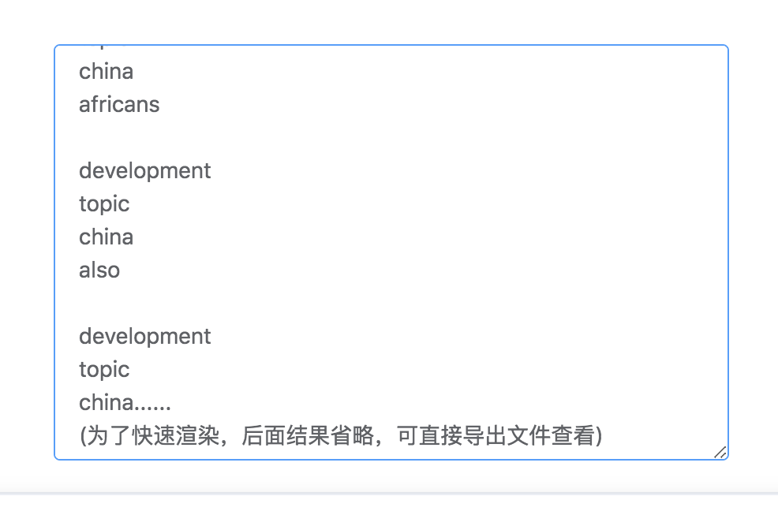
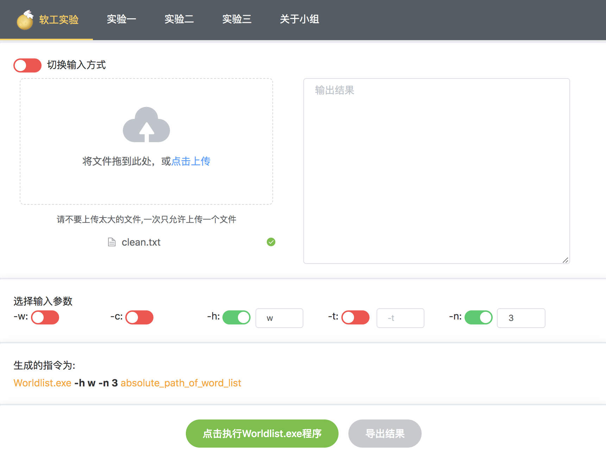
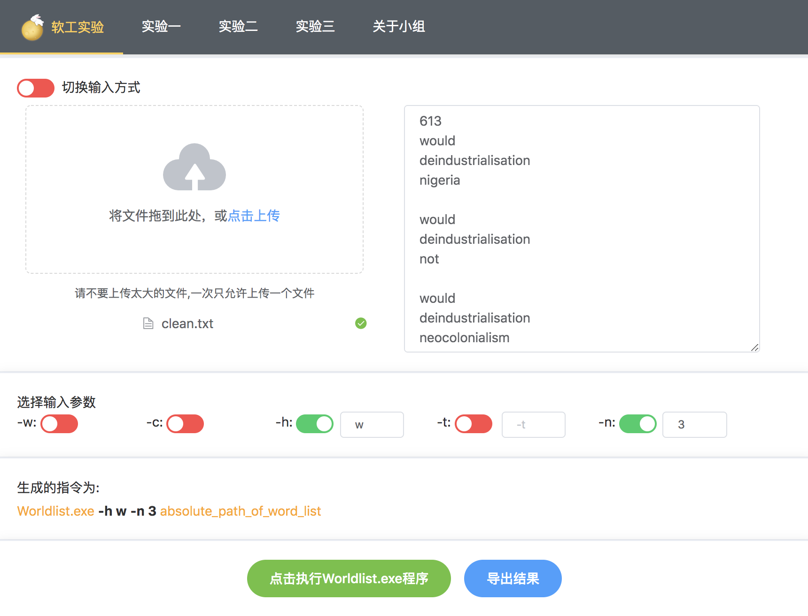
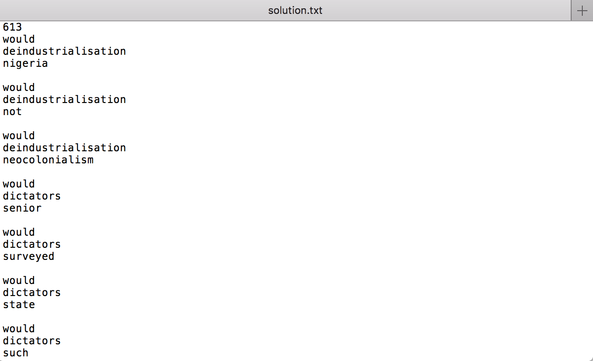

### GUI使用说明

**因为我们使用的是Web编程，所以为了不让助教不配置复杂的环境也能直接使用，我们已经把程序部署到服务器上，可以直接访问[http://129.204.51.127:8080](http://129.204.51.127:8080/)(因为域名还没备案，所以只能通过IP地址访问了)。第一次加载时间较长，所以请耐心等待(不要一直刷新，在等待期间可以看看报告以下部分)。此外网站版本出于安全考虑不支持文件上传功能，不过本地版本是支持上传功能的**

#### 运行环境:

操作系统: 不限

使用的语言: 前端使用Vue.js框架，后段使用nodejs语言，并使用express.js框架。

使用的库：比较多，因为使用npm版本管理，所以可以直接通过npm安装

nodejs版本: v8.11.1(这个比较重要，请使用8的版本)

npm版本: 6.5.0 (安装nodejs的时候一般会附带安装npm)

g++版本: 需要支持c++11标准

#### 运行方法:

先在GUI/server/目录下使用命令

```shell
make clean
make
```

将会使用g++编译源程序，如果默认的标准不是c++11的话可能会报错，这时请输入如下指令来指定c++11标准:

```shell
g++ y.cpp -o y -std=c++11
```

运行后会得到一个可执行文件 y

然后需要安装nodejs(注意是8版本，可以直接到官网下载)，接着在目录 GUI/server/目录下使用命令

```shell
npm install
```

然后在GUI/vueclient/目录下使用命令

```shell
npm install
```

以上两个命令是根据package.json文件中包的信息来安装相应的包，完成上面两个步骤后环境就搭建完成，下面需要在本地运行，在GUI/server/目录下使用命令:

```shell
npm start
```

这样后端就在3000端口开始运行，不要关闭这个正在运行的shell(bash)，然后打开另一个shell(bash)，在GUI/vueclient/目录下使用命令

```shell
npm run dev
```

这样前段就在8080端口运行

在浏览器打开[localhost:8080](localhost:8080)就可以看到主页，打开[localhost:8080/labone](localhost:8080/labone)可以看到实验一的部分。

#### 功能介绍

+ 界面:

  

  可以看到界面简洁清晰，一目了然下面详细介绍每一个功能

+ 支持两种导入单词文本的方式:（1）导入单词文本文件，（2）直接在界面上输入单词并提交

  先看到左上角有个切换输入模式，默认是文本输入，切换输入方式后变为:

  

  可以拖动文件上传或者直接选择文件上传

+ 提供可供用户交互的按钮和，实现-w-c-h-t-n这五个参数的功能，对于异 常情况需要给予用户提示 

  在参数输入部分可通过切换按钮来选择不同的参数，并且下方会显示生成的指令，然后对于错误的参数形式会在上方弹出错误提示，例如什么都不设置直接运行，会弹出:

  

  比如设置了-w，又想去设置-c，会弹出:

  

  比如-h参数设置了非小写字母:

  

  又比如-h参数设置了过多字母:

  

  总之我们能想到需要报错的地方都写了报错检测，以下是所有报错检测汇总:

  + -w -c -n 三个里面只能设置一个，当设置了两个时，会报错
  + -t -h 输入的字符只能是单个小写字符，当输入非法字符时，会报错
  + -n 输入的字符必须时数字，当输入非法字符时，会报错
  + 输入内容为空或者没有单词时，虽然不会报错，但是会显示"没有得到结果"

  对于网站版本，因为有网络传输的原因，与本地版本的报错有所不同，增加了以下几种报错

  + 如果输入的文本很大，在运行-w时会使服务器栈溢出，此时服务器将kill掉该进程并在输出框显示一个错误提示信息
  + 如果得到的结果过大，比如solution.txt大于1G，我想你也不会希望下载一个这么大的文件，所以这时将在输出框显示一个错误提示信息
  + 当切换输入方式时会提醒在网站版本中不允许文件上传

  当然以上三个报错在本地运行的版本中无需顾虑

  

+ 将结果直接输出到界面上，并提供“导出”按钮，将结果保存到用户指定的位置

  在执行程序旁边导出结果按钮，在未执行程序前它处于灰色，不可点击状态，如图所示：

  

  在成功执行了程序后，它变成可以点击的蓝色

  

  点击后就可以得到solution.txt文件，因为是Web编程，所以如果你的浏览器设置了默认下载目录，solution.txt会被直接下载到那个目录，如果没有设置默认下载目录，那么就可以选择一个目录来保存。

  

+ 其它友好化的内容

  对于大量数据的情况，可能需要运行一段时间，这时会在输出窗口出现倒计时提示，如下图所示:

  

  目前我们设定的时间为60秒，计时结束后会把能输出的最好结果放到输出框。比如 -n 指令会把在60s内找到的结果输出。

  此外为了加速前端页面渲染，当结果很大时输出框会提示只显示一部分内容:

  

  此时点击导出结果，可以导出完整的结果solution.txt

  

#### 运行展示

​	下面来看一下一次完整的使用过程，在本地运行的版本中使用文件上传方式，上传一个200多个单词的文本:


设置 -n 3 -h w 参数:



然后运行，得到如下结果



再点击导出结果，得到soluction.txt文件:



